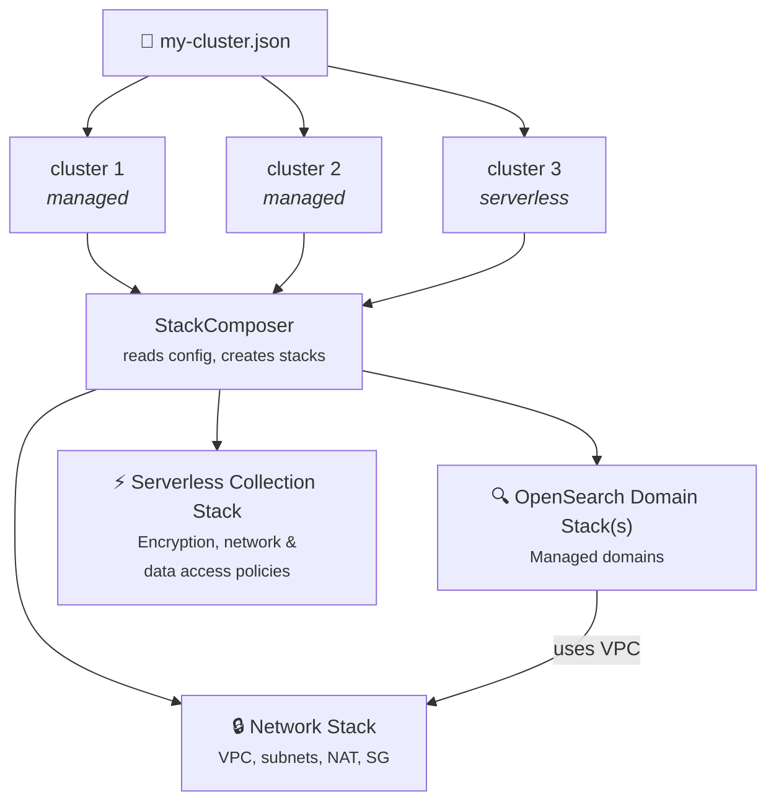

<p align="center">
  
</p>

<h1 align="center">Amazon OpenSearch Service CDK</h1>

<p align="center">
  Production-ready CDK infrastructure for deploying OpenSearch managed domains and serverless collections to AWS.<br>
  Multi-cluster · Serverless · CloudFormation templates · Secure defaults · Zero runtime dependencies.
</p>

<p align="center">
  <a href="https://github.com/aws-samples/amazon-opensearch-service-sample-cdk/actions/workflows/CI.yml"></a>
  <a href="https://github.com/aws-samples/amazon-opensearch-service-sample-cdk/releases/latest"></a>
  <a href="LICENSE"></a>
  
  
</p>

---

## Why This Project?

Standing up OpenSearch on AWS involves VPC networking, security groups, encryption policies, EBS tuning, and more — all before you write your first query. This project gives you a single JSON config that handles all of it:

- **Managed domains** with VPC isolation, encryption at rest, node-to-node encryption, and TLS 1.2 enforced by default
- **Serverless collections** (Search, Time Series, Vector Search) with zero VPC overhead
- **Multi-cluster deployments** — mix managed and serverless in one config file
- **Pre-built CloudFormation templates** in every release — deploy without CDK if you prefer
- **VPC mismatch protection** — catches dangerous subnet/VPC drift before CloudFormation does

> **Coming from 0.1.x?** The [v0.1.10 README](https://github.com/aws-samples/amazon-opensearch-service-sample-cdk/blob/v0.1.10/README.md) documents the previous API. See [Breaking Changes](#breaking-changes-from-01x) below.

---

## Table of Contents

- [Quick Start](#quick-start)
- [Deploy Without CDK](#deploy-without-cdk-cloudformation-templates)
- [Examples](#examples)
- [Configuration Reference](#configuration-reference)
- [Architecture](#architecture)
- [Secure Defaults](#secure-defaults)
- [VPC Mismatch Protection](#vpc-mismatch-protection)
- [Releasing](#releasing)
- [Development](#development)
- [Breaking Changes from 0.1.x](#breaking-changes-from-01x)
- [License](#license)

---

## Quick Start

### Prerequisites

- [Node.js](https://nodejs.org/) ≥ 20
- [AWS CDK CLI](https://docs.aws.amazon.com/cdk/v2/guide/getting-started.html) (`npm install -g aws-cdk`)
- AWS credentials configured (`aws configure` or environment variables)

### 1. Clone & Install

```bash
git clone https://github.com/aws-samples/amazon-opensearch-service-sample-cdk.git
cd amazon-opensearch-service-sample-cdk
npm install
```

### 2. Bootstrap (first time only)

```bash
cdk bootstrap
```

### 3. Create a Cluster Config

Create `my-cluster.json` (or copy one from [`examples/`](examples/)):

```json
{
  "stage": "dev",
  "vpcAZCount": 2,
  "clusters": [
    {
      "clusterId": "search",
      "clusterVersion": "OS_2.19",
      "clusterType": "OPENSEARCH_MANAGED_SERVICE"
    }
  ]
}
```

### 4. Validate (optional)

```bash
npm run validate -- --context contextFile=my-cluster.json
```

### 5. Deploy

```bash
cdk deploy "*" --context contextFile=my-cluster.json --require-approval never --concurrency 3
```

This creates a VPC with public/private subnets across 2 AZs, a security group, and an OpenSearch domain — all wired together with secure defaults.

### 6. Tear Down

```bash
cdk destroy "*"
```

> **Note:** The default `domainRemovalPolicy` is `RETAIN`. Set it to `DESTROY` in your config to delete domains on stack deletion.

---

## Deploy Without CDK (CloudFormation Templates)

Every [GitHub Release](https://github.com/aws-samples/amazon-opensearch-service-sample-cdk/releases) includes pre-synthesized, minified CloudFormation templates with full parameter support. No CDK, Node.js, or TypeScript required.

**Download the templates** from the latest release, then:

```bash
# 1. Deploy the VPC
aws cloudformation create-stack \
  --stack-name opensearch-network \
  --template-body file://cfn-NetworkStack.min.json \
  --parameters ParameterKey=Stage,ParameterValue=prod

# 2. Get the VPC outputs
SUBNETS=$(aws cloudformation describe-stacks --stack-name opensearch-network \
  --query 'Stacks[0].Outputs[?OutputKey==`PrivateSubnetIds`].OutputValue' --output text)
SG=$(aws cloudformation describe-stacks --stack-name opensearch-network \
  --query 'Stacks[0].Outputs[?OutputKey==`SecurityGroupId`].OutputValue' --output text)

# 3. Deploy the OpenSearch domain
aws cloudformation create-stack \
  --stack-name opensearch-domain \
  --template-body file://cfn-OpenSearchDomainStack.min.json \
  --parameters \
    ParameterKey=Stage,ParameterValue=prod \
    ParameterKey=SubnetIds,ParameterValue="$SUBNETS" \
    ParameterKey=SecurityGroupId,ParameterValue="$SG" \
    ParameterKey=DataNodeInstanceType,ParameterValue=r6g.xlarge.search \
    ParameterKey=EBSVolumeSize,ParameterValue=200
```

### CFN Template Parameters

**NetworkStack:** `Stage`, `VpcCidr`, `PublicSubnet1Cidr`, `PublicSubnet2Cidr`, `PrivateSubnet1Cidr`, `PrivateSubnet2Cidr`

**OpenSearchDomainStack:** `Stage`, `SubnetIds`, `SecurityGroupId`, `DomainName`, `EngineVersion`, `DataNodeInstanceType`, `DataNodeCount`, `DedicatedManagerNodeType`, `DedicatedManagerNodeCount`, `EBSVolumeSize`, `EBSVolumeType`, `EBSIops`, `EBSThroughput`

---

## Examples

Ready-to-use config files are in the [`examples/`](examples/) directory:

| File | Description |
|------|-------------|
| [`single-domain.json`](examples/single-domain.json) | Production managed domain with dedicated managers |
| [`serverless.json`](examples/serverless.json) | Serverless vector search collection — no VPC |
| [`multi-cluster.json`](examples/multi-cluster.json) | Mixed managed + serverless in one config |
| [`bring-your-own-vpc.json`](examples/bring-your-own-vpc.json) | Import an existing VPC |

```bash
# Deploy any example
cdk deploy "*" --context contextFile=examples/single-domain.json --require-approval never
```

### Single Managed Domain

The simplest production-ready config — a single domain with secure defaults:

```json
{
  "stage": "prod",
  "vpcAZCount": 2,
  "clusters": [
    {
      "clusterId": "search",
      "clusterVersion": "OS_2.19",
      "clusterType": "OPENSEARCH_MANAGED_SERVICE",
      "dataNodeType": "r6g.xlarge.search",
      "dataNodeCount": 2,
      "dedicatedManagerNodeType": "m6g.large.search",
      "dedicatedManagerNodeCount": 3,
      "ebsEnabled": true,
      "ebsVolumeSize": 500,
      "ebsVolumeType": "GP3",
      "ebsThroughput": 250,
      "domainRemovalPolicy": "RETAIN"
    }
  ]
}
```

### Serverless Collection

Deploy a serverless vector search collection — no VPC, no capacity planning:

```json
{
  "stage": "dev",
  "clusters": [
    {
      "clusterId": "embeddings",
      "clusterType": "OPENSEARCH_SERVERLESS",
      "collectionType": "VECTORSEARCH",
      "standbyReplicas": "DISABLED",
      "domainRemovalPolicy": "DESTROY"
    }
  ]
}
```

Collection types: `SEARCH`, `TIMESERIES`, `VECTORSEARCH`

### Multi-Cluster (Managed + Serverless)

Deploy multiple clusters from a single config — the VPC is shared across managed domains, and serverless collections skip VPC entirely:

```json
{
  "stage": "prod",
  "vpcAZCount": 3,
  "clusters": [
    {
      "clusterId": "search",
      "clusterType": "OPENSEARCH_MANAGED_SERVICE",
      "clusterVersion": "OS_2.19",
      "dataNodeType": "r6g.xlarge.search",
      "dataNodeCount": 6,
      "dedicatedManagerNodeType": "m6g.large.search",
      "dedicatedManagerNodeCount": 3,
      "ebsEnabled": true,
      "ebsVolumeSize": 500,
      "ebsVolumeType": "GP3",
      "ebsThroughput": 250,
      "domainRemovalPolicy": "RETAIN"
    },
    {
      "clusterId": "logs",
      "clusterType": "OPENSEARCH_MANAGED_SERVICE",
      "clusterVersion": "OS_2.19",
      "dataNodeType": "r6g.2xlarge.search",
      "dataNodeCount": 6,
      "ebsEnabled": true,
      "ebsVolumeSize": 2048,
      "domainRemovalPolicy": "RETAIN"
    },
    {
      "clusterId": "vectors",
      "clusterType": "OPENSEARCH_SERVERLESS",
      "collectionType": "VECTORSEARCH",
      "standbyReplicas": "ENABLED"
    }
  ]
}
```

**What gets created:**

| Stack | Resources |
|-------|-----------|
| `NetworkInfra-prod-<region>` | VPC, subnets (3 AZs), NAT gateways, security group |
| `OpenSearchDomain-search-prod-<region>` | Managed domain (6 data + 3 manager nodes) |
| `OpenSearchDomain-logs-prod-<region>` | Managed domain (6 data nodes, 2 TiB storage) |
| `OpenSearchServerless-vectors-prod-<region>` | Serverless collection (no VPC) |

### Bring Your Own VPC

Use an existing VPC instead of creating one:

```json
{
  "stage": "prod",
  "vpcId": "vpc-0123456789abcdef0",
  "clusters": [
    {
      "clusterId": "search",
      "clusterType": "OPENSEARCH_MANAGED_SERVICE",
      "clusterVersion": "OS_2.19",
      "clusterSubnetIds": ["subnet-aaa", "subnet-bbb"],
      "clusterSecurityGroupIds": ["sg-xxx"]
    }
  ]
}
```

---

## Configuration Reference

### General Options

| Option | Type | Required | Description |
|--------|------|:--------:|-------------|
| `stage` | string | ✅ | Environment name (max 15 chars). Used in stack names and resource naming. |
| `clusters` | array | ✅ | Array of cluster configurations (see below). |

### VPC Options

| Option | Type | Default | Description |
|--------|------|---------|-------------|
| `vpcId` | string | — | Import an existing VPC. Mutually exclusive with `vpcAZCount`/`vpcCidr`. |
| `vpcAZCount` | number | — | Number of AZs for the created VPC (1–3). |
| `vpcCidr` | string | `10.212.0.0/16` | CIDR block for the created VPC. |

### Cluster Options (All Types)

| Option | Type | Required | Description |
|--------|------|:--------:|-------------|
| `clusterId` | string | ✅ | Unique identifier (max 15 chars). |
| `clusterType` | string | ✅ | `OPENSEARCH_MANAGED_SERVICE` or `OPENSEARCH_SERVERLESS` |
| `clusterName` | string | — | Custom domain name. Default: `cluster-<stage>-<clusterId>` |
| `domainRemovalPolicy` | string | — | `RETAIN` (default) or `DESTROY` |

### Managed Domain Options

| Option | Type | Default | Description |
|--------|------|---------|-------------|
| `clusterVersion` | string | `OS_2.19` | Engine version (`OS_x.y` or `ES_x.y`) |
| `dataNodeType` | string | — | Instance type (e.g. `r6g.xlarge.search`) |
| `dataNodeCount` | number | AZ count | Number of data nodes |
| `dedicatedManagerNodeType` | string | — | Manager node instance type |
| `dedicatedManagerNodeCount` | number | — | Number of manager nodes |
| `warmNodeType` | string | — | UltraWarm instance type |
| `warmNodeCount` | number | — | Number of warm nodes |
| `ebsEnabled` | boolean | — | Enable EBS storage |
| `ebsVolumeSize` | number | — | Volume size in GiB |
| `ebsVolumeType` | string | `GP3` | `GP3`, `GP2`, `IO1`, `IO2` |
| `ebsIops` | number | — | Provisioned IOPS (GP3/IO1/IO2 only) |
| `ebsThroughput` | number | — | Throughput in MiB/s (GP3 only) |
| `encryptionAtRestEnabled` | boolean | `true` | Encrypt data at rest |
| `encryptionAtRestKmsKeyARN` | string | — | Custom KMS key ARN |
| `nodeToNodeEncryptionEnabled` | boolean | `true` | Node-to-node encryption |
| `enforceHTTPS` | boolean | `true` | Require HTTPS connections |
| `tlsSecurityPolicy` | string | `TLS_1_2` | Minimum TLS version |
| `openAccessPolicyEnabled` | boolean | `false` | Open access policy |
| `accessPolicies` | object | — | Custom IAM access policies |
| `useUnsignedBasicAuth` | boolean | `false` | Enable unsigned basic auth |
| `fineGrainedManagerUserARN` | string | — | Fine-grained access control IAM ARN |
| `fineGrainedManagerUserSecretARN` | string | — | Fine-grained access control secret ARN |
| `enableDemoAdmin` | boolean | `false` | Enable demo admin credentials |
| `loggingAppLogEnabled` | boolean | — | Enable application logging |
| `loggingAppLogGroupARN` | string | — | CloudWatch log group ARN |
| `clusterSubnetIds` | string[] | — | Subnet IDs (for imported VPC) |
| `clusterSecurityGroupIds` | string[] | — | Security group IDs (for imported VPC) |

### Serverless Collection Options

| Option | Type | Default | Description |
|--------|------|---------|-------------|
| `collectionType` | string | `SEARCH` | `SEARCH`, `TIMESERIES`, or `VECTORSEARCH` |
| `standbyReplicas` | string | `ENABLED` | `ENABLED` or `DISABLED` |

### Context Precedence

Configuration values are resolved in this order (highest priority first):

1. **CDK CLI context** — `-c stage=dev2`
2. **Context file** — `--context contextFile=my-cluster.json`
3. **`cdk.context.json`** — CDK-managed context cache
4. **`default-values.json` / `default-cluster-values.json`** — project defaults

---

## Architecture



**Smart VPC handling:**
- Managed clusters → NetworkStack created automatically (or use `vpcId` to import)
- Serverless-only → no NetworkStack, no VPC overhead
- Mixed → NetworkStack shared across all managed clusters

---

## Secure Defaults

Every domain is deployed with security best practices out of the box:

| Setting | Default | Why |
|---------|---------|-----|
| Encryption at rest | ✅ Enabled | Protects data on disk |
| Node-to-node encryption | ✅ Enabled | Encrypts inter-node traffic |
| HTTPS enforced | ✅ Required | No plaintext connections |
| TLS version | 1.2 minimum | Blocks deprecated protocols |
| EBS volume type | GP3 | Best price/performance ratio |
| Open access policy | ❌ Disabled | Explicit opt-in required |

Override any default in your cluster config or in `default-cluster-values.json`.

---

## VPC Mismatch Protection

OpenSearch domains are permanently bound to their VPC — they cannot be moved. If the NetworkStack is recreated with a new VPC while an existing domain remains in the old VPC, this project catches it early with a clear error:

```
VPC mismatch: OpenSearch domain 'cluster-prod-search' exists in VPC vpc-old123
but the deployment targets VPC vpc-new456. OpenSearch domains cannot be moved
between VPCs. Delete the existing domain (and its CloudFormation stack) first,
then redeploy.
```

This prevents the confusing CloudFormation error "The subnets must be in the same VPC" that gives no actionable guidance.

---

## Releasing

Automated via GitHub Actions. Each release includes:

| Artifact | Description |
|----------|-------------|
| `opensearch-service-domain-cdk-<version>.tgz` | npm package tarball |
| `cfn-NetworkStack.min.json` | Minified CloudFormation template |
| `cfn-OpenSearchDomainStack.min.json` | Minified CloudFormation template |

**One-click release:** Actions → "Version Bump" → Run workflow → select `patch` / `minor` / `prerelease`

**Manual release:**
```bash
npm version patch
git push origin main --follow-tags
```

### CI Pipeline

Every push and PR runs:

| Job | What it does |
|-----|-------------|
| `node-tests` | Lint + Jest across Node 20, 22, 24, 25 |
| `build` | TypeScript compilation + `npm pack` dry run |
| `link-checker` | Validates all links in docs |
| `all-ci-checks-pass` | Gate job for branch protection |

---

## Development

```bash
npm run build      # Compile TypeScript
npm run test       # Lint + Jest with coverage
npm run watch      # Watch mode
npm run validate   # Validate config (cdk synth dry run)
cdk synth          # Synthesize CloudFormation templates
cdk diff           # Compare with deployed stacks
```

### Project Structure

```
├── bin/
│   ├── app.ts              # CDK app entry point
│   ├── createApp.ts        # App factory
│   └── cfn-synth.ts        # Standalone CFN template synthesizer
├── lib/
│   ├── index.ts            # Public API barrel export
│   ├── stack-composer.ts   # Orchestrates multi-stack deployments
│   ├── network-stack.ts    # VPC, subnets, security groups
│   ├── opensearch-domain-stack.ts    # Managed OpenSearch domain
│   ├── serverless-collection-stack.ts # Serverless collection
│   └── components/
│       ├── cluster-config.ts    # ClusterConfig interface
│       ├── vpc-details.ts       # Immutable VPC details
│       ├── context-parsing.ts   # CDK context → typed config
│       ├── common-utilities.ts  # Shared constants & enums
│       └── cdk-logger.ts       # Logging utility
├── examples/               # Ready-to-use config files
├── test/                   # Jest test suites
├── .github/workflows/
│   ├── CI.yml              # Lint, test, build, link-check
│   ├── release.yml         # Tag-triggered release
│   └── version-bump.yml    # One-click version bump
└── default-cluster-values.json  # Secure defaults
```

### Using as a Library

This package can be consumed as a CDK construct library:

```typescript
import { StackComposer } from 'opensearch-service-domain-cdk';

const composer = new StackComposer(app, {
  env: { account: '123456789012', region: 'us-east-1' },
});
```

Peer dependencies: `aws-cdk-lib` ≥ 2.150.0, `constructs` ≥ 10.4.2

---

## Breaking Changes from 0.1.x

If you're upgrading from 0.1.x, these are the key changes:

| What changed | 0.1.x | 0.2.x |
|-------------|-------|-------|
| Stack props | `StackPropsExt` with `stage` | Inline `stage` on each stack's props |
| Domain stack props | `OpensearchDomainStackProps` (verbose) | `OpenSearchDomainStackProps` with `config: ClusterConfig` |
| Stack creation | `createOpenSearchStack()` factory | Direct `new OpenSearchDomainStack()` |
| VPC details | Mutable, deferred `initialize()` | Immutable, static factories (`fromCreatedVpc`, `fromVpcLookup`) |
| NetworkStack | Always created | Only created when managed clusters exist |
| Cluster types | Managed only | Managed + Serverless |

Full changelog: [CHANGELOG.md](CHANGELOG.md)

---

## License

This project is licensed under the [MIT-0](LICENSE) License.
