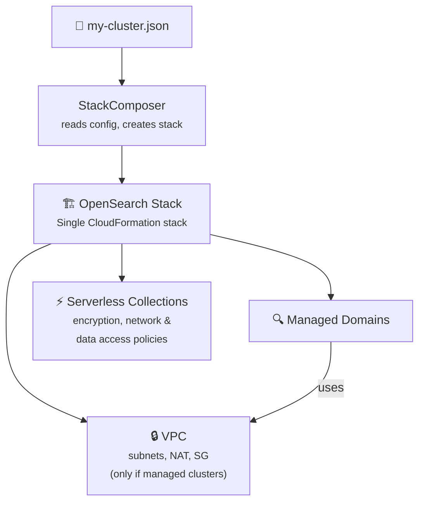

<p align="center">
  
</p>

<h1 align="center">Amazon OpenSearch Service Sample CDK</h1>

<p align="center">
  A sample CDK project demonstrating how to deploy OpenSearch managed domains and serverless collections to AWS.<br>
  Use as a reference, starting point, or learning resource for your own OpenSearch infrastructure.<br>
  Multi-cluster · Serverless · CloudFormation templates · Secure defaults · Zero runtime dependencies.
</p>

<p align="center">
  <a href="https://github.com/aws-samples/amazon-opensearch-service-sample-cdk/actions/workflows/CI.yml"></a>
  <a href="https://github.com/aws-samples/amazon-opensearch-service-sample-cdk/releases/latest"></a>
  <a href="LICENSE"></a>
  
  
</p>

---

> **📦 This is an [AWS Samples](https://github.com/aws-samples) project.** It is released as a sample/reference implementation — not an officially supported AWS service or product. Use it as a starting point, adapt it to your needs, and contribute back if you find improvements.

## Why This Project?

Standing up OpenSearch on AWS involves VPC networking, security groups, encryption policies, EBS tuning, and more — all before you write your first query. This sample project shows you how to handle all of it with a single JSON config:

- **Managed domains** with VPC isolation, encryption at rest, node-to-node encryption, and TLS 1.2 enforced by default
- **Serverless collections** (Search, Time Series, Vector Search) with zero VPC overhead
- **Collection groups** — multiple serverless collections sharing encryption, network, and data-access policies
- **Multi-cluster deployments** — mix managed and serverless in one config file
- **SAML authentication** — integrate with your identity provider
- **Pre-built CloudFormation templates** in every release — deploy without CDK if you prefer
- **JSON Schema validation** — IDE autocomplete and cross-type field rejection

> **Coming from 0.2.x?** See [Breaking Changes from 0.2.x](#breaking-changes-from-02x) below for the migration guide.
>
> **Coming from 0.1.x?** The [v0.1.10 README](https://github.com/aws-samples/amazon-opensearch-service-sample-cdk/blob/v0.1.10/README.md) documents the original API. See [Breaking Changes from 0.1.x](#breaking-changes-from-01x) below.

---

## Table of Contents

- [Quick Start](#quick-start)
- [Deploy Without CDK](#deploy-without-cdk-cloudformation-templates)
- [Examples](#examples)
- [Configuration Reference](#configuration-reference)
- [Architecture](#architecture)
- [Secure Defaults](#secure-defaults)
- [Releasing](#releasing)
- [Development](#development)
- [Breaking Changes from 0.2.x](#breaking-changes-from-02x)
- [Breaking Changes from 0.1.x](#breaking-changes-from-01x)
- [License](#license)

---

## Quick Start

### Prerequisites

- [Node.js](https://nodejs.org/) ≥ 20
- [AWS CDK CLI](https://docs.aws.amazon.com/cdk/v2/guide/getting-started.html) (`npm install -g aws-cdk`)
- AWS credentials configured (`aws configure` or environment variables)

### 1. Clone & Install

```bash
git clone https://github.com/aws-samples/amazon-opensearch-service-sample-cdk.git
cd amazon-opensearch-service-sample-cdk
npm install
```

### 2. Bootstrap (first time only)

```bash
cdk bootstrap
```

### 3. Create a Cluster Config

Create `my-cluster.json` (or copy one from [`examples/`](examples/)):

```json
{
  "stage": "dev",
  "vpcAZCount": 2,
  "clusters": [
    {
      "clusterId": "search",
      "clusterVersion": "OS_2.19",
      "clusterType": "OPENSEARCH_MANAGED_SERVICE"
    }
  ]
}
```

### 4. Validate (optional)

```bash
npm run validate -- --context contextFile=my-cluster.json
```

### 5. Deploy

```bash
./deploy.sh --stage dev --context-file my-cluster.json
```

Or directly with CDK:

```bash
cdk deploy --context contextFile=my-cluster.json --require-approval broadening
```

This creates a VPC with public/private subnets across 2 AZs, a security group, and an OpenSearch domain — all wired together with secure defaults. Adapt the config to match your requirements.

### 6. Tear Down

```bash
cdk destroy "*"
```

> **Note:** The default `domainRemovalPolicy` is `RETAIN`. Set it to `DESTROY` in your config to delete domains on stack deletion.

---

## Deploy Without CDK (CloudFormation Templates)

<details>
<summary>Deploy using pre-synthesized CloudFormation templates from GitHub Releases</summary>

Every [GitHub Release](https://github.com/aws-samples/amazon-opensearch-service-sample-cdk/releases) includes pre-synthesized, minified CloudFormation templates. No CDK, Node.js, or TypeScript required.

Since v0.3.0, the architecture uses a **single CloudFormation stack** containing VPC, managed domains, and serverless collections. The release includes separate templates for each deployment type:

| Template | Description |
|----------|-------------|
| `cfn-managed-domain.min.json` | Managed domain with VPC networking |
| `cfn-serverless-collection.min.json` | Serverless collection (no VPC) |
| `cfn-openSearchStack.min.json` | Combined (managed + serverless) |

**Download the template** from the [latest release](https://github.com/aws-samples/amazon-opensearch-service-sample-cdk/releases), then:

```bash
# Deploy a managed domain (single stack — includes VPC + domain)
aws cloudformation create-stack \
  --stack-name opensearch-prod \
  --template-body file://cfn-managed-domain.min.json \
  --capabilities CAPABILITY_IAM

# Or deploy a serverless collection
aws cloudformation create-stack \
  --stack-name opensearch-serverless \
  --template-body file://cfn-serverless-collection.min.json
```

> **Note:** The pre-built templates use the sample defaults from `bin/cfn-synth.ts`. To customize, clone the repo, edit your JSON config, and run `npx cdk synth` to produce a template tailored to your needs.

</details>

---

## Examples

Ready-to-use config files are in the [`examples/`](examples/) directory:

| File | Description |
|------|-------------|
| [`single-domain.json`](examples/single-domain.json) | Production managed domain with dedicated managers |
| [`serverless.json`](examples/serverless.json) | Serverless vector search collection — no VPC |
| [`multi-cluster.json`](examples/multi-cluster.json) | Mixed managed + serverless in one config |
| [`bring-your-own-vpc.json`](examples/bring-your-own-vpc.json) | Import an existing VPC |

```bash
# Deploy any example
cdk deploy "*" --context contextFile=examples/single-domain.json --require-approval never
```

### Single Managed Domain

<details>
<summary>A sample config for a single domain with secure defaults</summary>

```json
{
  "stage": "prod",
  "vpcAZCount": 2,
  "clusters": [
    {
      "clusterId": "search",
      "clusterVersion": "OS_2.19",
      "clusterType": "OPENSEARCH_MANAGED_SERVICE",
      "dataNodeType": "r6g.xlarge.search",
      "dataNodeCount": 2,
      "dedicatedManagerNodeType": "m6g.large.search",
      "dedicatedManagerNodeCount": 3,
      "ebsEnabled": true,
      "ebsVolumeSize": 500,
      "ebsVolumeType": "GP3",
      "ebsThroughput": 250,
      "domainRemovalPolicy": "RETAIN"
    }
  ]
}
```

</details>

### Serverless Collection

<details>
<summary>Deploy a serverless vector search collection — no VPC, no capacity planning</summary>

```json
{
  "stage": "dev",
  "clusters": [
    {
      "clusterId": "embeddings",
      "clusterType": "OPENSEARCH_SERVERLESS",
      "collectionType": "VECTORSEARCH",
      "standbyReplicas": "DISABLED",
      "domainRemovalPolicy": "DESTROY"
    }
  ]
}
```

Collection types: `SEARCH`, `TIMESERIES`, `VECTORSEARCH`

</details>

### Multi-Cluster (Managed + Serverless)

<details>
<summary>Deploy multiple clusters from a single config — VPC shared across managed domains, serverless skips VPC</summary>

```json
{
  "stage": "prod",
  "vpcAZCount": 3,
  "clusters": [
    {
      "clusterId": "search",
      "clusterType": "OPENSEARCH_MANAGED_SERVICE",
      "clusterVersion": "OS_2.19",
      "dataNodeType": "r6g.xlarge.search",
      "dataNodeCount": 6,
      "dedicatedManagerNodeType": "m6g.large.search",
      "dedicatedManagerNodeCount": 3,
      "ebsEnabled": true,
      "ebsVolumeSize": 500,
      "ebsVolumeType": "GP3",
      "ebsThroughput": 250,
      "domainRemovalPolicy": "RETAIN"
    },
    {
      "clusterId": "logs",
      "clusterType": "OPENSEARCH_MANAGED_SERVICE",
      "clusterVersion": "OS_2.19",
      "dataNodeType": "r6g.2xlarge.search",
      "dataNodeCount": 6,
      "ebsEnabled": true,
      "ebsVolumeSize": 2048,
      "domainRemovalPolicy": "RETAIN"
    },
    {
      "clusterId": "vectors",
      "clusterType": "OPENSEARCH_SERVERLESS",
      "collectionType": "VECTORSEARCH",
      "standbyReplicas": "ENABLED"
    }
  ]
}
```

**What gets created:**

A single CloudFormation stack `OpenSearch-prod-<region>` containing:
- VPC with subnets across 3 AZs, NAT gateways, and security group
- Two managed OpenSearch domains (`search` and `logs`)
- One serverless vector search collection (`vectors`)

</details>

### Bring Your Own VPC

<details>
<summary>Use an existing VPC instead of creating one</summary>

```json
{
  "stage": "prod",
  "vpcId": "vpc-0123456789abcdef0",
  "clusters": [
    {
      "clusterId": "search",
      "clusterType": "OPENSEARCH_MANAGED_SERVICE",
      "clusterVersion": "OS_2.19",
      "clusterSubnetIds": ["subnet-aaa", "subnet-bbb"],
      "clusterSecurityGroupIds": ["sg-xxx"]
    }
  ]
}
```

</details>

---

## Configuration Reference

### General Options

| Option | Type | Required | Description |
|--------|------|:--------:|-------------|
| `stage` | string | ✅ | Environment name (max 15 chars). Used in stack names and resource naming. |
| `clusters` | array | ✅ | Array of cluster configurations (see below). |

### VPC Options

| Option | Type | Default | Description |
|--------|------|---------|-------------|
| `vpcId` | string | — | Import an existing VPC. Mutually exclusive with `vpcAZCount`/`vpcCidr`. |
| `vpcAZCount` | number | — | Number of AZs for the created VPC (1–3). |
| `vpcCidr` | string | `10.212.0.0/16` | CIDR block for the created VPC. |

### Cluster Options (All Types)

| Option | Type | Required | Description |
|--------|------|:--------:|-------------|
| `clusterId` | string | ✅ | Unique identifier (max 15 chars). |
| `clusterType` | string | ✅ | `OPENSEARCH_MANAGED_SERVICE` or `OPENSEARCH_SERVERLESS` |
| `clusterName` | string | — | Custom domain name. Default: `cluster-<stage>-<clusterId>` |
| `domainRemovalPolicy` | string | — | `RETAIN` (default) or `DESTROY` |

### Managed Domain Options

<details>
<summary>All options for <code>OPENSEARCH_MANAGED_SERVICE</code> clusters</summary>

| Option | Type | Default | Description |
|--------|------|---------|-------------|
| `clusterVersion` | string | `OS_2.19` | Engine version (`OS_x.y` or `ES_x.y`) |
| `dataNodeType` | string | — | Instance type (e.g. `r6g.xlarge.search`) |
| `dataNodeCount` | number | AZ count | Number of data nodes |
| `dedicatedManagerNodeType` | string | — | Manager node instance type |
| `dedicatedManagerNodeCount` | number | — | Number of manager nodes |
| `warmNodeType` | string | — | UltraWarm instance type |
| `warmNodeCount` | number | — | Number of warm nodes |
| `ebsEnabled` | boolean | — | Enable EBS storage |
| `ebsVolumeSize` | number | — | Volume size in GiB |
| `ebsVolumeType` | string | `GP3` | `GP3`, `GP2`, `IO1`, `IO2` |
| `ebsIops` | number | — | Provisioned IOPS (GP3/IO1/IO2 only) |
| `ebsThroughput` | number | — | Throughput in MiB/s (GP3 only) |
| `encryptionAtRestEnabled` | boolean | `true` | Encrypt data at rest |
| `encryptionAtRestKmsKeyARN` | string | — | Custom KMS key ARN |
| `nodeToNodeEncryptionEnabled` | boolean | `true` | Node-to-node encryption |
| `enforceHTTPS` | boolean | `true` | Require HTTPS connections |
| `tlsSecurityPolicy` | string | `TLS_1_2` | Minimum TLS version |
| `openAccessPolicyEnabled` | boolean | `false` | Open access policy |
| `accessPolicies` | object | — | Custom IAM access policies |
| `useUnsignedBasicAuth` | boolean | `false` | Enable unsigned basic auth |
| `fineGrainedManagerUserARN` | string | — | Fine-grained access control IAM ARN |
| `fineGrainedManagerUserSecretARN` | string | — | Fine-grained access control secret ARN |
| `enableDemoAdmin` | boolean | `false` | Enable demo admin credentials |
| `loggingAppLogEnabled` | boolean | — | Enable application logging |
| `loggingAppLogGroupARN` | string | — | CloudWatch log group ARN |
| `clusterSubnetIds` | string[] | — | Subnet IDs (for imported VPC) |
| `clusterSecurityGroupIds` | string[] | — | Security group IDs (for imported VPC) |
| `coldStorageEnabled` | boolean | — | Enable UltraWarm cold storage (requires warm nodes + dedicated managers) |
| `multiAZWithStandbyEnabled` | boolean | — | Enable Multi-AZ with Standby |
| `offPeakWindowEnabled` | boolean | — | Enable off-peak maintenance window |

</details>

### SAML Authentication Options

<details>
<summary>Options for SAML-based authentication on managed domains</summary>

| Option | Type | Default | Description |
|--------|------|---------|-------------|
| `samlEntityId` | string | — | SAML identity provider entity ID |
| `samlMetadataContent` | string | — | SAML metadata XML content |
| `samlMasterUserName` | string | — | SAML master username for Dashboards |
| `samlMasterBackendRole` | string | — | SAML master backend role |
| `samlRolesKey` | string | — | SAML assertion element for roles |
| `samlSubjectKey` | string | — | SAML assertion element for username |
| `samlSessionTimeoutMinutes` | number | `60` | SAML session timeout (1–1440 minutes) |

</details>

### Serverless Collection Options

<details>
<summary>All options for <code>OPENSEARCH_SERVERLESS</code> clusters</summary>

| Option | Type | Default | Description |
|--------|------|---------|-------------|
| `collectionType` | string | `SEARCH` | `SEARCH`, `TIMESERIES`, or `VECTORSEARCH` |
| `standbyReplicas` | string | `ENABLED` | `ENABLED` or `DISABLED` |
| `vpcEndpointId` | string | — | VPC endpoint ID (disables public access) |
| `dataAccessPrincipals` | string[] | Account root | IAM principal ARNs for data access policy |
| `collections` | array | — | Collection group (see below) |

#### Collection Groups

Deploy multiple collections sharing encryption, network, and data-access policies:

```json
{
  "clusterId": "my-group",
  "clusterType": "OPENSEARCH_SERVERLESS",
  "collectionType": "SEARCH",
  "collections": [
    { "collectionName": "logs", "collectionType": "TIMESERIES" },
    { "collectionName": "search-data" }
  ]
}
```

Each entry creates a separate collection. Per-entry `collectionType` overrides the cluster-level default.

</details>

### Context Precedence

<details>
<summary>How configuration values are resolved</summary>

Configuration values are resolved in this order (highest priority first):

1. **CDK CLI context** — `-c stage=dev2`
2. **Context file** — `--context contextFile=my-cluster.json`
3. **`cdk.context.json`** — CDK-managed context cache
4. **`default-values.json` / `default-cluster-values.json`** — project defaults

</details>

---

## Architecture



**Single stack deployment:** Everything goes into one CloudFormation stack (`OpenSearch-<stage>-<region>`).

**Smart VPC handling:**
- Managed clusters → VPC created automatically (or use `vpcId` to import)
- Serverless-only → no VPC, no VPC overhead
- Mixed → VPC shared across all managed clusters

---

## Secure Defaults

Every domain deployed with this sample uses security best practices out of the box:

| Setting | Default | Why |
|---------|---------|-----|
| Encryption at rest | ✅ Enabled | Protects data on disk |
| Node-to-node encryption | ✅ Enabled | Encrypts inter-node traffic |
| HTTPS enforced | ✅ Required | No plaintext connections |
| TLS version | 1.2 minimum | Blocks deprecated protocols |
| EBS volume type | GP3 | Best price/performance ratio |
| Open access policy | ❌ Disabled | Explicit opt-in required |

Override any default in your cluster config or in `default-cluster-values.json`.

---

## Releasing

<details>
<summary>Automated release process via GitHub Actions</summary>

Automated via GitHub Actions. Each release includes:

| Artifact | Description |
|----------|-------------|
| `opensearch-service-domain-cdk-<version>.tgz` | npm package tarball |
| `cfn-openSearchStack.min.json` | Combined CloudFormation template (managed + serverless) |
| `cfn-managed-domain.min.json` | Managed domain only CloudFormation template |
| `cfn-serverless-collection.min.json` | Serverless collection only CloudFormation template |

**One-click release:** Actions → "Version Bump" → Run workflow → select `patch` / `minor` / `prerelease`

**Manual release:**
```bash
npm version patch
git push origin main --follow-tags
```

</details>

### CI Pipeline

Every push and PR runs:

| Job | What it does |
|-----|-------------|
| `node-tests` | Lint + Jest across Node 20, 22, 24, 25 |
| `build` | TypeScript compilation + `npm pack` dry run |
| `cfn-lint` | Synthesize and lint CloudFormation templates |
| `cfn-diff` | CDK diff on PRs (shows infrastructure changes) |
| `link-checker` | Validates all links in docs |
| `all-ci-checks-pass` | Gate job for branch protection |

---

## Development

```bash
npm run build      # Compile TypeScript
npm run test       # Lint + Jest with coverage
npm run watch      # Watch mode
npm run validate   # Validate config (cdk synth dry run)
cdk synth          # Synthesize CloudFormation templates
cdk diff           # Compare with deployed stacks
```

### Project Structure

<details>
<summary>Directory layout</summary>

```
├── bin/
│   ├── app.ts              # CDK app entry point
│   ├── createApp.ts        # App factory
│   └── cfn-synth.ts        # Standalone CFN template synthesizer
├── lib/
│   ├── index.ts            # Public API barrel export
│   ├── stack-composer.ts   # Reads config, creates single stack
│   ├── opensearch-stack.ts # VPC + managed domains + serverless collections
│   └── components/
│       ├── cluster-config.ts    # ClusterConfig types + ClusterType enum
│       ├── vpc-details.ts       # Immutable VPC details
│       ├── context-parsing.ts   # CDK context → typed config
│       ├── common-utilities.ts  # Engine version + removal policy parsing
│       └── cdk-logger.ts       # Logging utility
├── examples/               # Ready-to-use config files
├── deploy.sh               # Build + deploy wrapper script
├── cluster-config.schema.json  # JSON Schema with discriminated validation
├── test/                   # Jest test suites
├── .github/workflows/
│   ├── CI.yml              # Lint, test, build, cfn-lint, cfn-diff
│   ├── release.yml         # Tag-triggered release
│   └── version-bump.yml    # One-click version bump
└── default-cluster-values.json  # Secure defaults
```

</details>

### Using as a Library

<details>
<summary>Consume this sample as a CDK construct library in your own projects</summary>

This sample can be consumed as a CDK construct library in your own projects.

#### Install from GitHub Release

Every [release](https://github.com/aws-samples/amazon-opensearch-service-sample-cdk/releases) publishes an npm tarball:

```bash
# Install a specific version
npm install https://github.com/aws-samples/amazon-opensearch-service-sample-cdk/releases/download/v0.3.0/opensearch-service-domain-cdk-0.3.0.tgz
```

#### Use in your CDK app

```typescript
import { App } from 'aws-cdk-lib';
import { StackComposer, OpenSearchStack } from 'opensearch-service-domain-cdk';

// Option 1: Use StackComposer (reads config from CDK context)
const app = new App();
new StackComposer(app, {
  env: { account: '123456789012', region: 'us-east-1' },
});

// Option 2: Use OpenSearchStack directly
new OpenSearchStack(app, 'MyOpenSearch', {
  stage: 'prod',
  managedClusters: [{
    clusterId: 'search',
    clusterType: 'OPENSEARCH_MANAGED_SERVICE',
    clusterName: 'my-domain',
    dataNodeType: 'r6g.large.search',
    dataNodeCount: 2,
  }],
  serverlessClusters: [],
  env: { account: '123456789012', region: 'us-east-1' },
});
```

#### Peer dependencies

| Package | Version |
|---------|---------|
| `aws-cdk-lib` | ≥ 2.150.0 |
| `constructs` | ≥ 10.4.2 |
| `cdk-nag` | ≥ 2.28.0 |

</details>

---

## Breaking Changes from 0.2.x

If you're upgrading from 0.2.x, these are the key changes in 0.3.x:

| What changed | 0.2.x | 0.3.x |
|-------------|-------|-------|
| Stack architecture | 4 separate stacks (`NetworkStack`, `OpenSearchDomainStack`, `ServerlessCollectionStack`, `MonitoringStack`) | Single `OpenSearchStack` — one `cdk deploy` = one CloudFormation stack |
| Stack name pattern | `NetworkInfra-<stage>-<region>`, `OpenSearchDomain-<id>-<stage>-<region>`, etc. | `OpenSearch-<stage>-<region>` |
| Monitoring | `MonitoringStack` with 7 CloudWatch alarms (opt-in via `monitoringEnabled`) | Removed — configure alarms externally if needed |
| VPC validation Lambda | Custom resource checking VPC mismatch before domain updates | Removed — simpler stack, fewer IAM permissions |
| JSON Schema | Flat validation — all fields optional on every cluster type | Discriminated `if/then/else` — managed fields rejected on serverless and vice versa |
| Serverless collections | One collection per `clusterId` | Collection groups via `collections` array — multiple collections sharing policies |
| Auth | Basic auth, fine-grained access, open access | Added SAML authentication (7 new config fields) |
| Storage | EBS + UltraWarm | Added cold storage (`coldStorageEnabled`) |
| HA | Multi-AZ via `vpcAZCount` | Added Multi-AZ with Standby (`multiAZWithStandbyEnabled`) + off-peak window |
| Data access (serverless) | Account root gets full access | Scoped via `dataAccessPrincipals` (defaults to account root for backward compat) |
| Deploy script | Manual `cdk deploy` commands | `deploy.sh` with `--stage`, `--context-file`, `--dry-run` |
| CI | Build, test, cfn-lint, link-checker | Added `cfn-diff` job showing infrastructure changes on PRs |
| `common-utilities.ts` | Mixed concerns (constants, enums, parsers, secret creation, exports) | Slimmed — `ClusterType` moved to `cluster-config.ts`, `createBasicAuthSecret`/`generateClusterExports` now private on `OpenSearchStack` |
| Public API | `createBasicAuthSecret`, `generateClusterExports` exported | Removed from public API — now private methods |

<details>
<summary>Migration steps</summary>

1. **Stack consolidation**: Your existing stacks will need to be replaced. Deploy the new single stack, migrate data, then tear down old stacks. Or destroy and redeploy if data loss is acceptable.
2. **Remove monitoring config**: Delete `monitoringEnabled` and `snsTopicArn` from your config files.
3. **Update imports**: If using as a library, replace `NetworkStack`, `OpenSearchDomainStack`, `ServerlessCollectionStack` imports with `OpenSearchStack`.
4. **Schema validation**: Run `npm run validate` — the discriminated schema will now reject cross-type fields that were silently ignored before.

</details>

> **Previous version docs:** [v0.2.10 README](https://github.com/aws-samples/amazon-opensearch-service-sample-cdk/blob/v0.2.10/README.md)

---

## Breaking Changes from 0.1.x

<details>
<summary>Migration guide from 0.1.x to 0.2.x</summary>

If you're upgrading from 0.1.x, these are the key changes:

| What changed | 0.1.x | 0.2.x |
|-------------|-------|-------|
| Stack props | `StackPropsExt` with `stage` | Inline `stage` on each stack's props |
| Domain stack props | `OpensearchDomainStackProps` (verbose) | `OpenSearchDomainStackProps` with `config: ClusterConfig` |
| Stack creation | `createOpenSearchStack()` factory | Direct `new OpenSearchDomainStack()` |
| VPC details | Mutable, deferred `initialize()` | Immutable, static factories (`fromCreatedVpc`, `fromVpcLookup`) |
| NetworkStack | Always created | Only created when managed clusters exist |
| Cluster types | Managed only | Managed + Serverless |

> **Previous version docs:** [v0.1.10 README](https://github.com/aws-samples/amazon-opensearch-service-sample-cdk/blob/v0.1.10/README.md)

</details>

---

## License

This sample code is licensed under the [MIT-0](LICENSE) License. See the [LICENSE](LICENSE) file.
